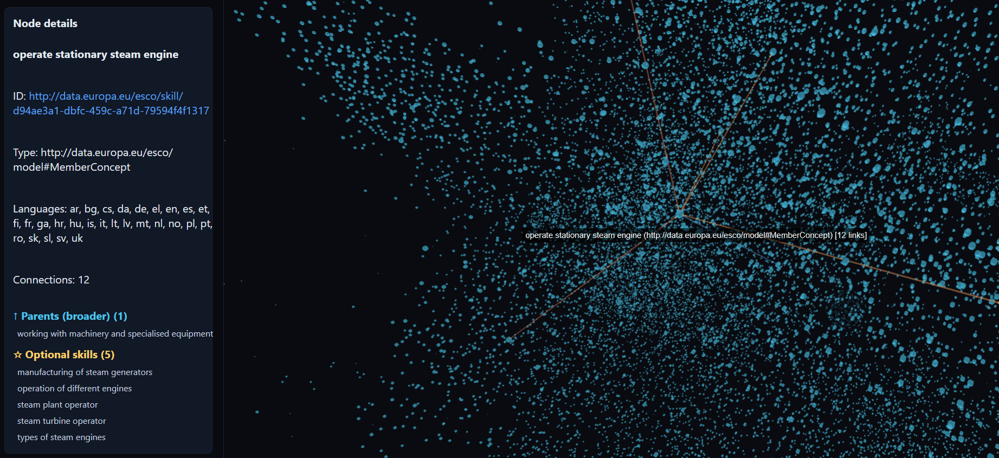

# esco-graph

Interactive 3D visualization of the [ESCO](https://esco.ec.europa.eu/) (European Skills, Competences, Qualifications and Occupations) dataset using React, TypeScript, and [react-force-graph-3d](https://github.com/vasturiano/react-force-graph).



## How it works

The pipeline has two stages:

1. **`data/flatten.sh`** — offline preprocessing that turns the raw ESCO JSON-LD (~627 MB) into a compact flat JSON file (~200 MB):
   - Flattens JSON-LD with `jsonld.flatten()`
   - Resolves preferred labels (English text) and language metadata from Label entities
   - Filters out metadata-only entity types (NodeLiteral, AssociationObject, Identifier, LabelRole, Label)
   - Creates `external` stub nodes for link targets outside the dataset (ISCO, DBpedia, etc.)
   - Pre-computes a 3D force-directed layout using `d3-force-3d` (~300 simulation ticks)
   - Writes a flat JSON array with `x`, `y`, `z` positions on every node

2. **Browser app** — zero-physics 3D renderer that loads the pre-positioned graph:
   - Web Worker parses the JSON and builds the graph (nodes + links)
   - `react-force-graph-3d` renders with `warmupTicks=0` — no simulation, instant display
   - All interactivity is filtering/coloring, not layout computation

## Quick start

```bash
npm install

# Generate the flat file (requires the ESCO JSON-LD in data/)
bash data/flatten.sh data/esco-v1.2.1.json-ld

# Start the dev server
npm run dev
```

Open `http://localhost:5173` and load the generated `data/esco-v1.2.1-flat.json` file.

## Features

### Graph visualization
- Pre-computed 3D layout — explore ~24K nodes and ~314K links without browser physics
- Trackball camera controls (rotate, zoom, shift+drag to pan)
- Link culling — links only render for hovered/selected nodes to keep the scene readable
- Directional arrows on links when a node is selected

### Search
- Unified search by node label (substring match)
- Matching nodes highlighted in gold, non-matches fade out
- Clickable results list — click to fly to a node and select it

### Hierarchy visualization
When a node is selected, its neighbors are color-coded by relationship role:
- **White** — selected node
- **Cyan** — parents (broader)
- **Green** — children (narrower)
- **Pink** — essential skills
- **Gold** — optional skills

The details panel groups neighbors by role with clickable links for hierarchy navigation.

### Filters
- **Type toggles** — show/hide entity types (Skill, Occupation, ConceptScheme, etc.)
- **Language filter** — highlight nodes available in a specific language
- **Min-degree slider** — hide weakly-connected nodes

### Node details
- Label, type, languages, connection count
- Clickable URI that opens the ESCO portal in a new tab
- Grouped neighbor list by hierarchy role

## Relationship types

Six relationship types are extracted from ESCO:

| Relationship | Meaning |
|---|---|
| `broader` | Parent concept in the hierarchy |
| `narrower` | Child concept in the hierarchy |
| `isEssentialSkillFor` | Skill required for an occupation |
| `isOptionalSkillFor` | Skill optional for an occupation |
| `relatedEssentialSkill` | Essential skill association |
| `relatedOptionalSkill` | Optional skill association |

## Data processing notes

The flatten step discards metadata entities that are not meaningful for graph visualization:
- **NodeLiteral** — description/definition text
- **AssociationObject** — skill level and reuse metadata
- **Identifier** — ISCO/ISCED cross-reference codes
- **LabelRole** — label role classifications
- **Label** — resolved into `preferredLabel` text and `languages` arrays, then removed

Core entity types and all skill↔occupation relationships are fully preserved.

## Tech stack

- [Vite](https://vitejs.dev/) + React + TypeScript
- [react-force-graph-3d](https://github.com/vasturiano/react-force-graph) (Three.js)
- [d3-force-3d](https://github.com/vasturiano/d3-force-3d) (offline layout)
- [jsonld](https://github.com/digitalbazaar/jsonld.js) (flatten step)
- [stream-json](https://github.com/uhop/stream-json) (streaming large JSON-LD)
- Web Workers for off-main-thread processing
